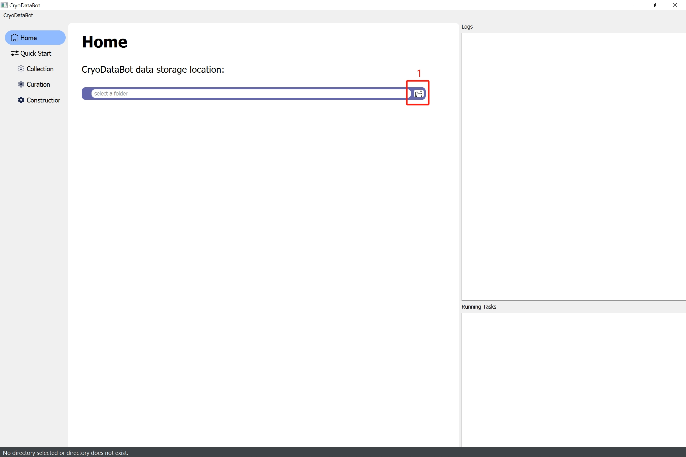
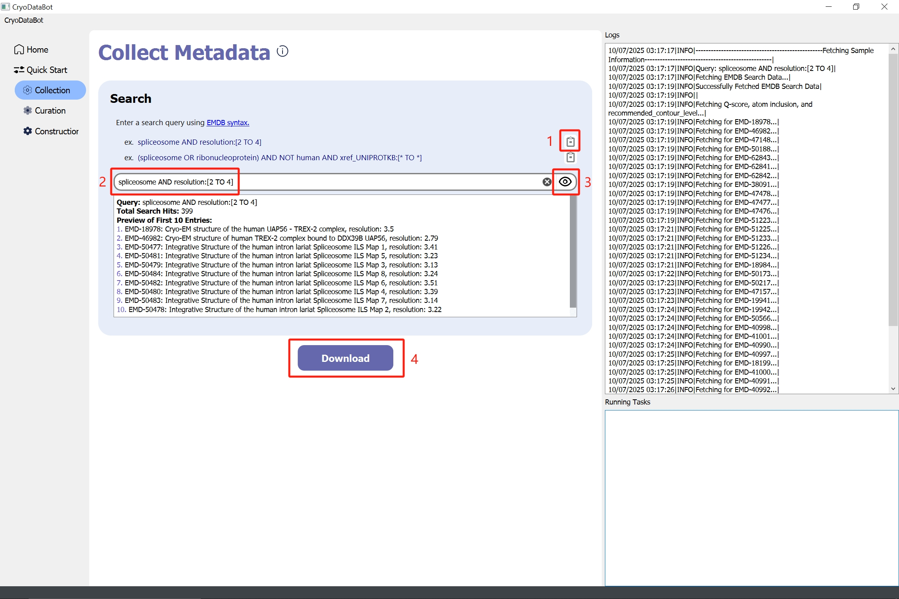
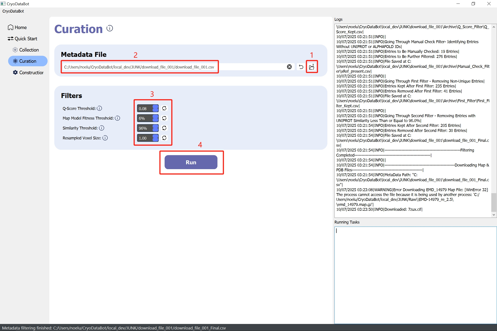
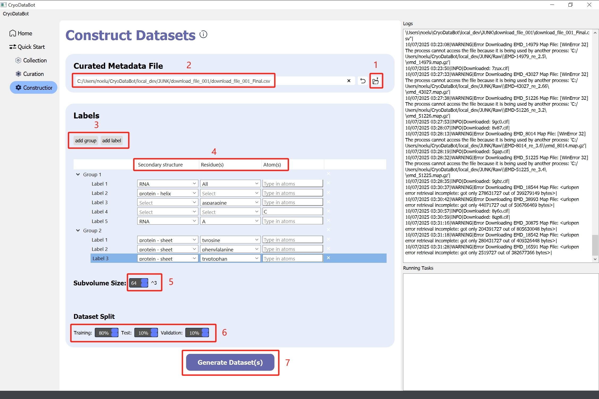
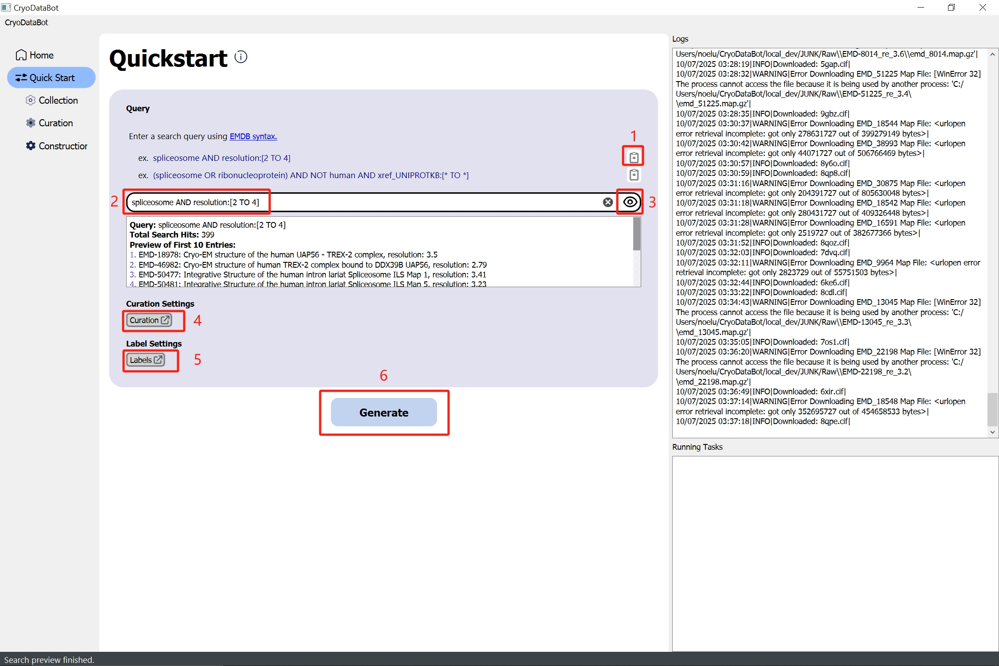
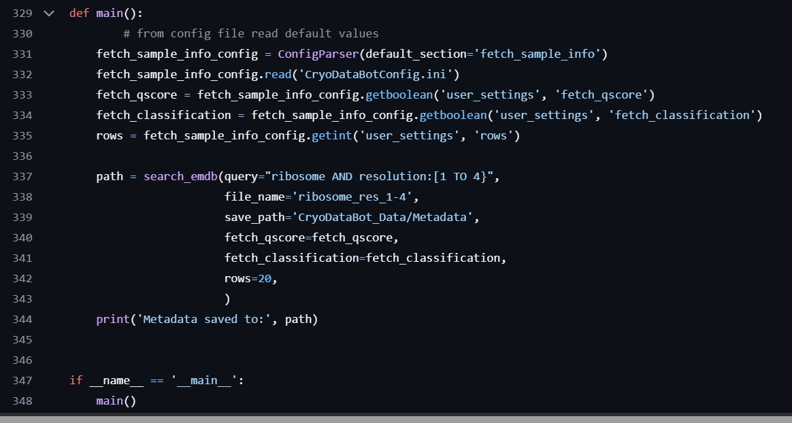
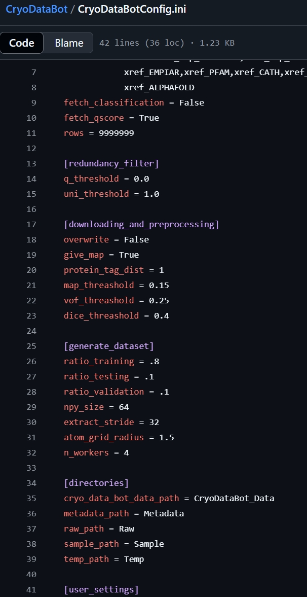

<a id="readme-top"></a>

# CryoDataBot

CryoDataBot is a Python workflow designed for curating high-quality cryoEM datasets for AI-driven structural biology.

## Table of Contents

- [Prerequisites](#prerequisites)
- [Installation](#installation)
- [Usage](#usage)
  - [1. Running the GUI](#1-running-the-gui)
  - [2. Standard workflow](#2-standard-workflow)
  - [3. Quickstart](#3-quickstart)
  - [4. Command-line interface (CLI)](#4-command-line-interface-cli)
  - [5. Running backend scripts modularly](#5-running-backend-scripts-modularly)
- [Project Structure](#project-structure)
- [License](#license)

## Prerequisites
python version >=3.8

## Installation

### Option 1: Run from source
This option gives you full control, including being able to run the core backend scripts modularly (see [5. Running backend scripts modularly](#5-running-backend-scripts-modularly)).

Clone the repo and change directory to CryoDataBot.
```sh
git clone https://github.com/t00shadow/CryoDataBot.git
cd CryoDataBot

# Create a virtual environment
python3 -m venv .venv
```
Activate the virtual environment and pip install packages from the requirements.txt.

> Linux/Mac:
```sh
source .venv/bin/activate
pip install -r requirements.txt
```

> Windows:
```sh
.\.venv\Scripts\activate
pip install -r requirements.txt
```

### Option 2: Download pre-built binaries (executables) under Releases
If you only want to use the GUI:

[Download latest release](https://github.com/t00shadow/CryoDataBot/releases/latest)

<p align="right">(<a href="#readme-top">back to top</a>)</p>

## Usage
### 1. Running the GUI
#### If running from source:
&nbsp;&nbsp;&nbsp;&nbsp;Run as a module with -m:
```sh
python -m cryodatabot
```
&nbsp;&nbsp;&nbsp;&nbsp;OR run as a script directly:
```sh
python run_gui.py
```

#### If running pre-built binary (executable):
&nbsp;&nbsp;&nbsp;&nbsp;Double click the executable.

<p align="right">(<a href="#readme-top">back to top</a>)</p>

### 2. Standard workflow
<ol type="i">
  <li><b>Home Page</b></li></br>
  
  <ol type="1">
    <li>Select a base directory (home folder) for output files to be saved in.</li>
  </ol>

  </br>
  
  <li><b>Step 1: Collect Metadata</b></li></br>
  
  <ol type="1">
    <li>(Optional) Copy an example query.</li>
    <li>Paste or type in search query.</li>
    <li>Preview query button (takes ~1-2 seconds). Useful for sanity checking before downloading the full metadata. Full metadata takes longer to download since a few metadata fields do not have a batch API access point and must be fetched one by one.</li>
    <li>Download full metadata. Returns a CSV file. Can take a few minutes depending on the query.</li>
  </ol>

  </br>
  
  <li><b>Step 2: Curation</b></li></br>
  
  <ol type="1">
    <li>Browse for the metadata CSV file downloaded from previous step. This is automatically handled if you just ran the previous step.</li>
    <li>File path of raw metadata file. Automatically populated if you just ran the previous step.</li>
    <li>Filters. Can type in values, click on the blue buttons, or use mouse scroll wheel. Click the circular arrow buttons to reset to default values. Default values filter out the least amount of data.</li>
    <li>Run button. <b>Note: this step is quite time-intensive.</b> Map and model files are downloaded and then processed. The map files generally range from a few hundred megabytes to a gigabyte, so internet speeds can make a noticeable difference. The processing step is also quite time-consuming. This step also creates a CSV file (appends "_Final" to the metadata CSV file's name).</li>
  </ol>

  </br>
  
  <li><b>Step 3: Construct Datasets</b></li></br>
  
  <ol type="1">
    <li>Browse for the CSV file created by the previous step (has "_Final" at the end of its name). This is automatically handled if you just ran the previous step.</li>
    <li>File path of said CSV file. Automatically populated if you just ran the previous step.</li>
    <li>Add groups and labels. Each group creates one labeled dataset. So multiple groups means differently labeled datasets from the same data.</li>
    <li>Each label has 3 columns: secondary structure, residue(s), atom(s). The columns can be combined or used separately (see picture above).</li>
    <li>The data is split into cubes based on subvolume size. In other words, subvolume size is the size of those cubes.</li>
    <li>Training, test, validation split.</li>
    <li>Generate datasets. Takes maybe a few minutes.</li>
  </ol>
</ol>

<p align="right">(<a href="#readme-top">back to top</a>)</p>

### 3. Quickstart
Same as the standard workflow but **without** intermediate output. Tradeoff is less clicks and all the user input is up front, so you can let it run to completion, without having to come back between steps.


1. (Optional) Copy an example query.
2. Paste or type in search query.
3. Preview query button (takes ~1-2 seconds). Useful for sanity checking. The rest of the workflow takes way more time.
4. Curation page pop up button. Launches the curation page but in a popup window. Difference from standard workflow is nothing is downloaded yet.
5. Dataset labels page pop up button. Launches the dataset labels page but in a popup window.
6. Generate datasets. All heavy backend processing happens now.

<p align="right">(<a href="#readme-top">back to top</a>)</p>

### 4. Command-line interface (CLI)
fix this, on another branch, need to check something (think need to change some imports or paths)

[INSERT IMAGE(S) HERE]

<p align="right">(<a href="#readme-top">back to top</a>)</p>

### 5. Running backend scripts modularly
<details> 
<summary> (Optional) If you want to run the backend scripts individually: </summary>
  
  **This only works if you cloned the repository.**
  
  There are 4 core backend scripts (see <a href="#project-structure">Project Structure</a>). 
  
  _Note: The curation page in the GUI uses 2 of them, hence why the GUI only has 3 pages in the standard workflow._
  
  ```
  python -m cryodatabot.src.backend.core.[backend_script]
  ```
  Options are `fetch_sample_info`, `redundancy_filter`, `downloading_and_preprocessing_NO_GPU2`, and `generate_dataset`. Running as a module, so drop the ".py" suffix.

  Ex)
  ```
  python -m cryodatabot.src.backend.core.fetch_sample_info
  ```

  To change user inputs (parameters, thresholds, paths, etc.), one way is to modify the `main()` function of the target script directly (ex. the `main()` function of `fetch_sample_info.py`), and then run the above command. Each of the 4 core backend scripts has a `main()` function with example usage. 
  
  The other way is edit the config file CryoDataBotConfig.ini (located in the root level directory).

  Ex) fetch_sample_info.py's main() function. Instead of using the config file, you replace those lines with hardcoded values:

  

  .ini file (config file):

  


</details>

<p align="right">(<a href="#readme-top">back to top</a>)</p>

## Project Structure

```
CryoDataBot
├── cryodatabot
│   ├── src
│   │   ├── backend
│   │   │   ├── core
│   │   │   │   ├── fetch_sample_info.py
│   │   │   │   ├── redundancy_filter.py
│   │   │   │   ├── downloading_and_preprocessing_NO_GPU2.py
│   │   │   │   └── generate_dataset.py
│   │   │   └── helper
│   │   │       └── ...
│   │   └── frontend
│   │       └── ...
│   ├── __main__.py
│   └── main_gui.py
├── CryoDataBotConfig.ini
├── LICENSE
├── README.md
├── requirements.txt
└── run_gui.py
```

<p align="right">(<a href="#readme-top">back to top</a>)</p>

## License
This project is licensed under the terms of the [MIT License](LICENSE).

<p align="right">(<a href="#readme-top">back to top</a>)</p>

